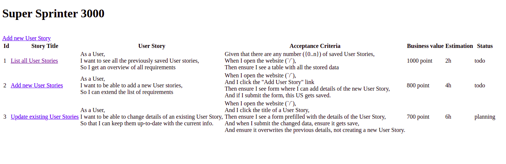
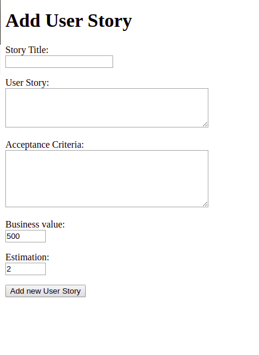
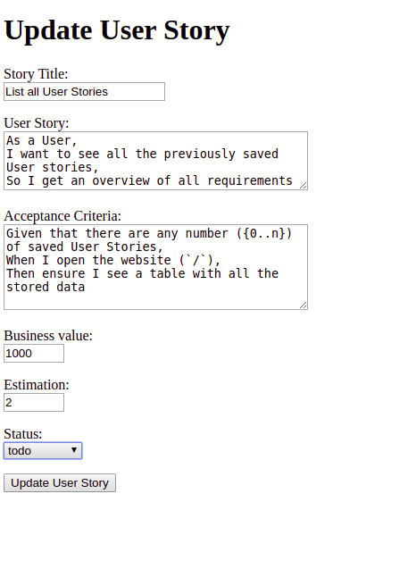

# Super Sprinter 3000

An Agile development helper software built with Flask microserver.





## Features

* List of all user stories
* Adding new user story
* Updating existing user story





For adding and updatig user sotories there is validation inccluded according to the following rules:
Story Title:
* single line text input
* required
* minimum length: 5 character

User Story:
* multi-line text input
* required

Acceptance Criteria:
* multi-line text input
* required

Business value
* single line number input
* minimum value: 100
* maximum value: 1500
* allow values only dividable by 100

Estimation
* single line number input
* minimum value: 0.5
* maximum value: 40
* allow values only dividable by 0.5

After subbmiting the user storie is stored in csv file.





Update feature has additional dropdown list to mark the status of the task.

## Before development

To install all the *pip* dependencies, run the following command:
```
pip install -r requirements.txt
```


## Testing

To tests your work, you can run the provided acceptance tests.

